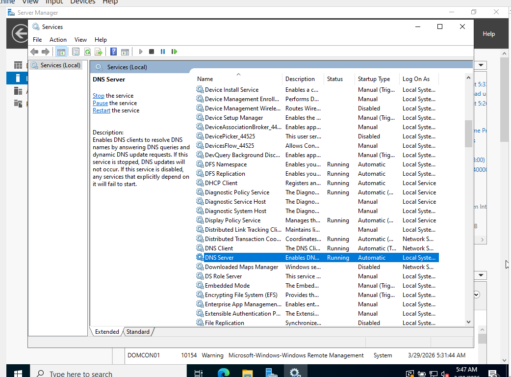

# Windows Server 2022 Lab

This project documents a hands-on Windows Server 2022 lab built in Oracle VM VirtualBox to practice core server administration tasks. The lab focuses on local server review, update management, services, system logs, storage layout, and firewall settings.

Lab Objectives
- Review Windows Server 2022 administrative tools
- Confirm local server settings
- Check update status
- Review active services
- Inspect system logs
- Review disk layout
- Confirm firewall status

Server Manager Overview

I opened Server Manager to review the main administrative dashboard after completing initial server configuration. This shows the primary management console with installed server roles and healthy service indicators.

Local Server Review

I reviewed the local server properties to confirm hostname, domain membership, network settings, and hardware details. This shows the server identity, operating system version, memory allocation, and active network configuration.

Windows Update

I checked Windows Update after restarting the virtual machine to confirm the server was fully updated. This shows the current update status and confirms the system is up to date.

Services Management

I opened the Services console to verify that core infrastructure services were running correctly. This shows the DNS Server service active with automatic startup enabled.

Event Viewer Review

I opened Event Viewer to review recent system activity and service events. This shows the System log with informational entries and service-related events.

Disk Management

I opened Disk Management to review the virtual disk structure and partition layout. This shows the operating system partition, system reserved partition, and recovery partition.

Windows Security Protection

I reviewed Windows Security settings to confirm firewall protection across network profiles. This shows domain, private, and public firewall profiles enabled.

Skills Practiced

Windows Server 2022 administration
Server Manager navigation
Windows Update review
Service monitoring
Event log analysis
Disk management review
Firewall verification

Summary

This lab demonstrates practical Windows Server administration inside a virtual environment. It shows core operating system tasks commonly used in IT support and junior systems administration work.
